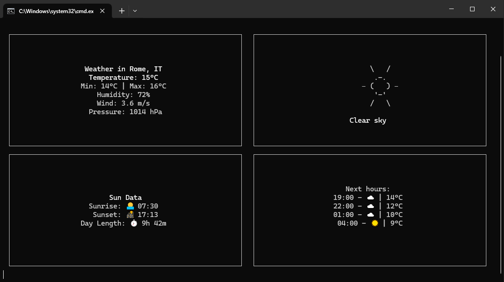

# 🌤️ Terminal Weather Dashboard

A terminal-based weather dashboard built with React Ink and OpenWeather API. Features ASCII art weather visualizations, hourly forecasts, and responsive terminal layout.

This project was made during a coding session for my Youtube Channel AsmrCoding, here it is the [link of the video](https://www.youtube.com/watch?v=3rfssU4WbKc), subscribe, leave a like and a comment for support the channel! Thanks 🙏 

## 📸 Demo



## ✨ Features

- Real-time weather conditions display
- ASCII art weather visualizations
- Hourly forecast
- Sun data tracking (sunrise, sunset, day length)
- Responsive terminal layout
- Temperature, humidity, wind, and pressure data

## ⚡ Requirements
- Node.js
- OpenWeather API key

## 🛠️ Setup

1. Clone repo

``` git clone https://github.com/Simoblaster/terminal-weather.git ```

2. Install dependencies

``` npm install ```

3. Configure environment variables:

Copy ``` .env.example ``` to ``` .env ```  
Update the values in .env according to your setup
```
OPENWEATHER_API_KEY=xxx        # Your OpenWeather Api key
```

4. Run the project

``` npm run dev ```

## 📫 Contact

- X: [@Simoblaster](https://x.com/simoblaster)
- Email: saturno.simone@gmail.com
